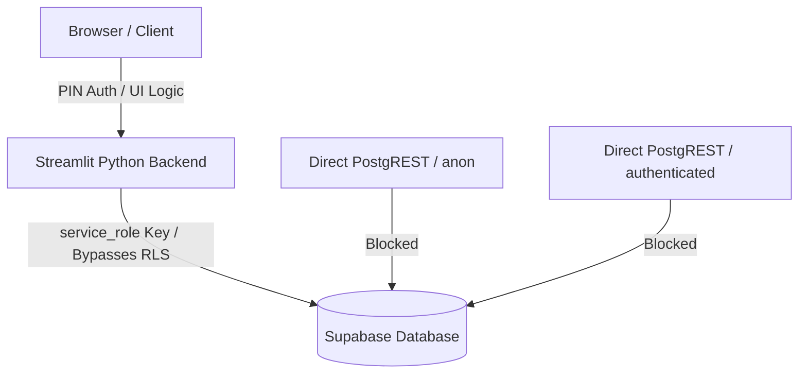

# REMONTIQ SUPABASE SECURITY POLICY

This document defines the permanent database security rules for the RemontIQ project. All database migrations, tables, views, and schemas must strictly adhere to these guidelines.

---

## 1. Core Security Model



* **Client/Browser** connects exclusively to the **Streamlit Python Backend** (Server-Side).
* **Streamlit Python Backend** connects to Supabase via the official `supabase-py` client using the **`service_role`** key (which safely bypasses RLS).
* **Direct Web/API Clients** (`anon` and `authenticated` roles) must have **zero direct access** to public database tables.

---

## 2. SQL Security Templates

### 📝 SECURITY TEMPLATE FOR NEW PUBLIC TABLE
Use this template for every new public table. Replace `new_table` and `optional_sequence_name` accordingly.

```sql
-- SECURITY TEMPLATE FOR NEW PUBLIC TABLE
-- Replace: new_table, optional_sequence_name

alter table public.new_table enable row level security;

revoke all privileges on table public.new_table
from anon, authenticated, public;

grant all privileges on table public.new_table
to service_role;

-- If table uses serial/identity sequence:
-- revoke all privileges on sequence public.optional_sequence_name
-- from anon, authenticated, public;
--
-- grant usage, select on sequence public.optional_sequence_name
-- to service_role;
```

### 👁️ SECURITY TEMPLATE FOR NEW PUBLIC VIEW
Use this template for every new public view. Replace `new_view` accordingly.

```sql
-- SECURITY TEMPLATE FOR NEW PUBLIC VIEW
-- Replace: new_view

revoke all privileges on table public.new_view
from anon, authenticated, public;

grant all privileges on table public.new_view
to service_role;
```

---

## 3. Explicitly Forbidden Commands

Under no circumstances should any migration or script contain:
* 🛑 `grant all on table ... to anon;`
* 🛑 `grant all on table ... to authenticated;`
* 🛑 `grant usage on sequence ... to anon;`
* 🛑 `grant usage on sequence ... to authenticated;`

---

## 4. Post-Migration Verification Checklist

After deploying any database change, verify that:
1. No public table has RLS disabled.
2. No public allow-all policies exist.
3. `anon`, `authenticated`, and `public` roles have zero grants on tables.
4. `anon`, `authenticated`, and `public` roles have zero grants on sequences.
5. The `service_role` has all required access to execute backend operations.
